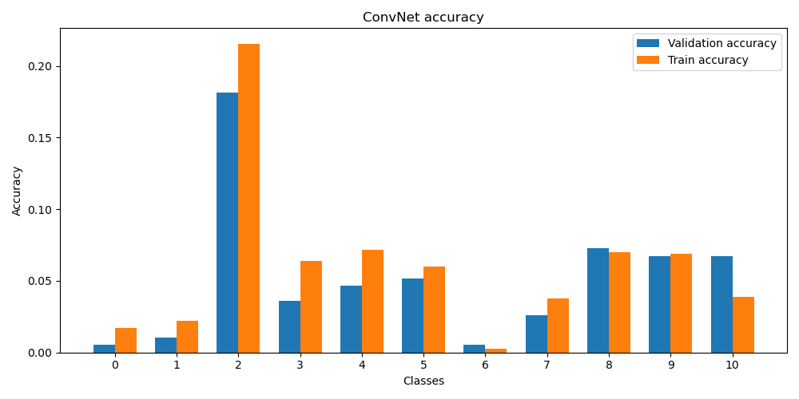
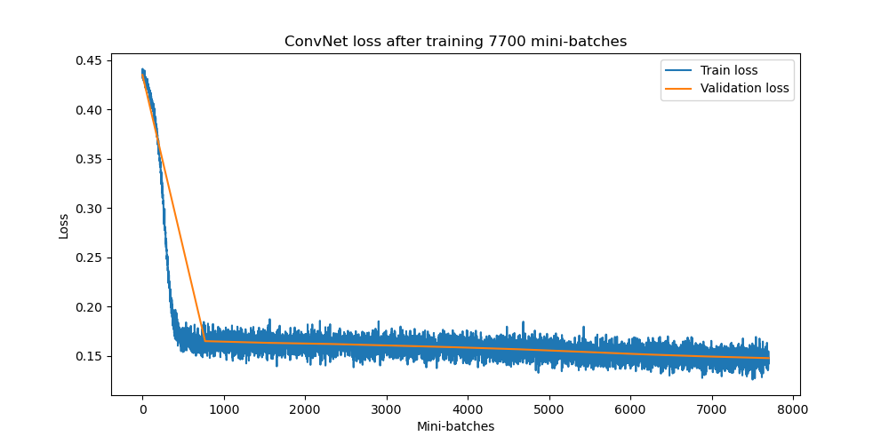

# Galaxy Zoo

Learning research project on classification of galaxy imagery using machine learning algorithms incl. exploration of CNNs and Transfer Learning and practice of multi-classification tasks. All findings can be recreated using the [project notebook file](./ML4PA_Galaxy_Zoo_Project.ipynb) and the project and its results are elaborated upon in the [project pdf](./ML4PA_Galaxy_Zoo_Project.pdf)

## Sneak peak into results

  
  

